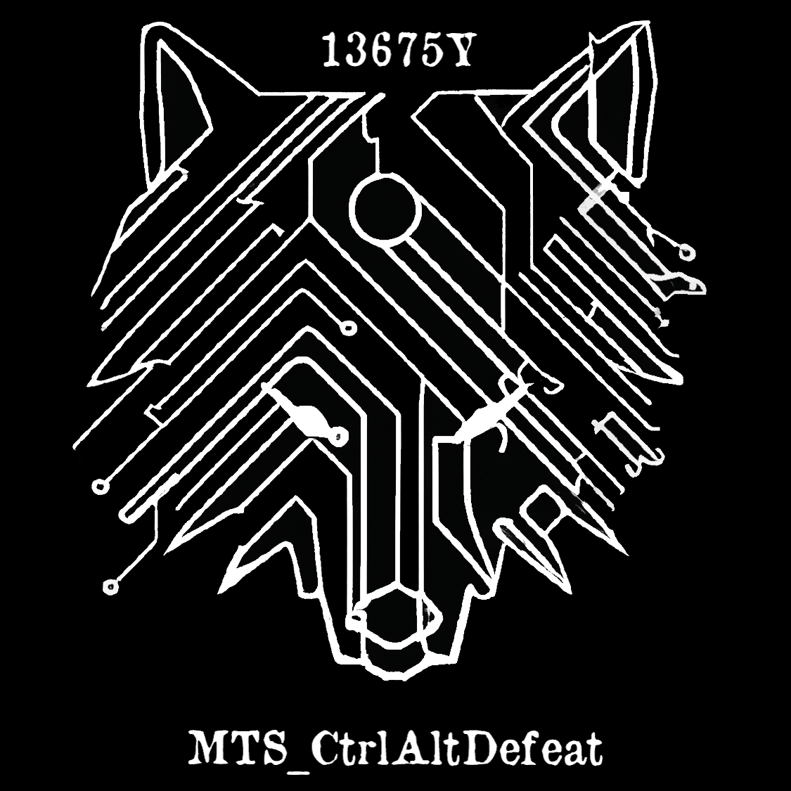

# 13765Y MTS_CtrlAltDefeat Code 2023-24

This repo contains code for the VEX VRC team 13765Y MTS_CtrlAltDefeat.

Notebook will be uploaded after the season.

## Wiring Setup
Ports 9 and 10 - right of the drivetrain
Ports 8 and 7 - left of the drivetrain

## To do

- [x] Tank drive
- [x] simple debugging info
- [ ] on screen visuals
- [x] catapult (code ready, builders not)
- [ ] intake (waiting on builders)
- [x] logarithmic drive code

## Changelog
#### V1.0
##### 10/11/23
Initial version - the robot can move.

#### V1.1
##### 16/11/23
Added incremental speed movement.

#### V2.0
##### 19/11/23
Changed movement so that left stick controls left drive and right stick controls right drive (a.k.a. tank drive).

Also the old movement code now applies to arrow buttons.

#### V2.1
##### 24/11/23
* Reversed the robot so the front is now the back and the back is now the front.
* Added debugging to stick movement
* Removed arrow key movement

#### V2.2
##### 1/12/23
* Added exponential drive code to allow for precision at low input
* Added code to support a flywheel, with the arrow keys acting like a slider

#### V2.3
##### 24/01/24
* Added a simple auton script
* Increased flywheel "slider" to +50 per click